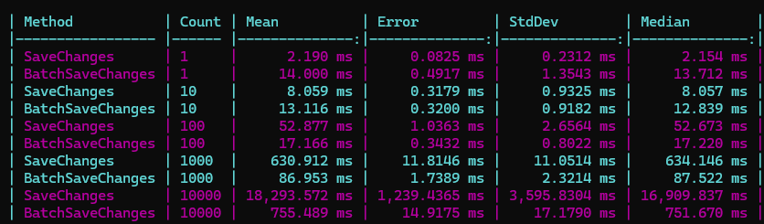

# EntityFramework.BulkOperations

A lightweight library for Entity Framework and Entity Framework Core that provides efficient bulk operations specifically optimized for **SQL Server**.

## Features

- **BulkSaveChanges**: A high-performance alternative to the standard `SaveChanges` when dealing with a large number of entities.
- **BulkUpsert**: Efficiently insert or update entities in bulk using SQL Server's `MERGE` statement.
- Support for **Entity Framework 6** and **Entity Framework Core**.
- Async support for all operations.
- Uses `SqlBulkCopy` for maximum performance during data transfer.

## Installation

You can install the package via NuGet:

```bash
# For Entity Framework 6
dotnet add package BulkOperations.EntityFramework

# For Entity Framework Core
dotnet add package BulkOperations.EntityFrameworkCore
```

## Usage

### BulkSaveChanges

Instead of calling `context.SaveChanges()`, which sends entities to the database one by one, use `BulkSaveChanges()` to process them in batches:

```csharp
using BulkOperations.EntityFramework; // or BulkOperations.EntityFrameworkCore

// ... add many entities to the context ...
foreach (var entity in entities)
{
    context.MyEntities.Add(entity);
}

context.BulkSaveChanges();
```

### BulkUpsert

Perform a bulk insert or update (upsert) operation on a collection of entities. This method uses the primary key by default to match existing records.

```csharp
var entities = new List<MyEntity> { ... };
context.BulkUpsert(entities);
```

You can also specify a custom set of fields to use for matching and updating:

```csharp
context.BulkUpsert(entities, x => new { x.ExternalId, x.Name });
```

## Why is it faster, or why do I have free resources in my system, but inserting by single line is slow?

In the I/O subsystem, completing a write operation does not necessarily guarantee that data has been physically written to the storage device. To ensure data integrity, write-through caching is employed.

In transactional database systems, every statement executes within a transaction context. Whether transactions are explicitly defined or implicitly created, each statement is processed as an individual (sub)transaction, ensuring atomic execution — it either completes successfully or rolls back entirely.

The data required for transaction rollback is recorded in the transaction log using write-through caching. The server will not continue the operation until writing is complete This mechanism prevents loss of commit information in scenarios where the server shuts down after data modifications have been persisted but before corresponding log entries have been fully written.

So in single line solution one trnsaction (and writing-throgh caching with awaiting) per line, in bulk solution two transactions per batch.




## Requirements

- **SQL Server**: This library uses SQL Server-specific features like `SqlBulkCopy` and `MERGE` statements.
- **Entity Framework**: Compatible with EF 6.3+ and EF Core.

## License

This project is licensed under the MIT License - see the [LICENSE](LICENSE) file for details.
